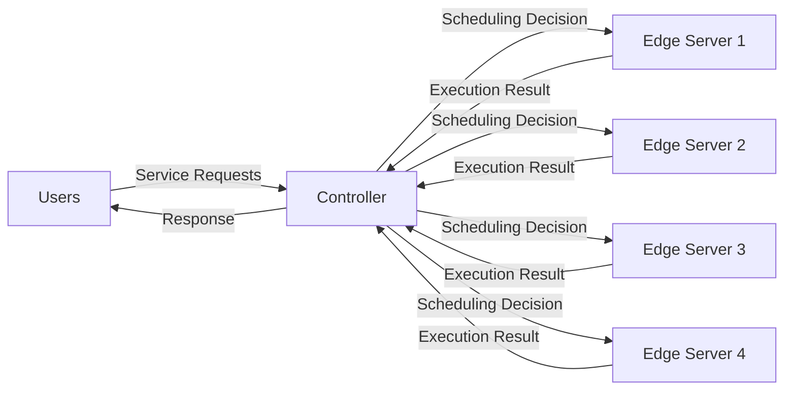
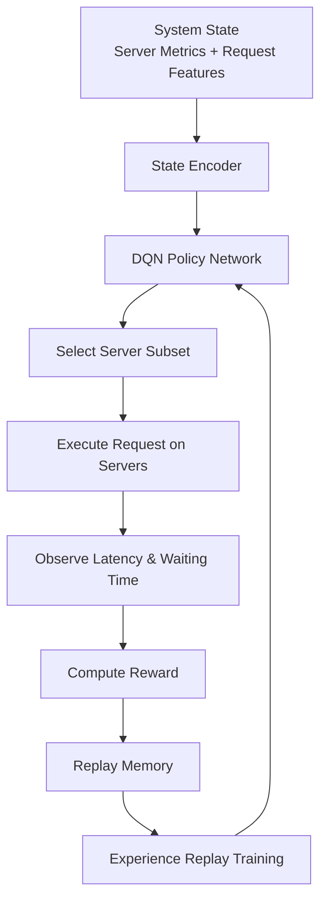

# SafeTail 2.0


SafeTail 2.0 is an **intelligent workload scheduling framework for heterogeneous edge computing environments** that uses **Reinforcement Learning (RL)** to dynamically allocate service requests across edge servers.

> ⚠️ **This copy is under active correction.** It was seeded verbatim from
> `SafeTail-2.0-main` and is being repaired per **`plan.md`**. Several claims in
> the sections below were **inherited from the source and are wrong** — see
> **`audit/ERRATA.md`** (specification defects S-01…S-17) and **`CHANGELOG.md`**
> (code fixes, D-xx / M-xx). Corrected passages are flagged inline with a
> `[SAFETAIL][FIX][…]` blockquote. Where this README still disagrees with the
> code, **the code wins** (`plan.md` R7).

This repository extends the **SafeTail 1.0 framework** with a Deep-RL controller
that learns scheduling strategies from system state and workload characteristics.
(The original line here said "…and queue delays" — there is no queue; see the
Queueing Model section, `D-13`/`D-24`.)

The system is designed for **latency-sensitive applications deployed on heterogeneous edge devices**.

---
# Usage Guide

## 1. Install Dependencies

```bash
pip install -r requirements.txt
```

---

## 2. Configure Parameters

Edit `src/constants.py`  to adjust:

* Number of servers (`beta`)
* Learning rate
* Batch size
* Reward discount factor
* Logging folder
* Baseline mode

Example:

```python
BASELINE_MODE = "safetail"
```

Available modes:

* `safetail` → RL-based scheduling
* `minload_1`, `minload_2`, `minload_3`
* `minprop_1`, `minprop_2`, `minprop_3`
* `rand_1`, `rand_2`, `rand_3`

---
## 3. Navigate to src/

```bash
cd src/
```

## 4. Start Training

Run main.py:

```bash
python main.py
```

or 

```bash
nohup python main.py > logs.txt 2>&1 &
```

to run in background and redirect output to a txt file
This will:

* Receive requests
* Select servers using RL or baselines
* Compute rewards
* Train the DQN model
* Save logs and plots 

---

## 5. Outputs Generated

During execution, the project automatically stores:

### Logs

```text
training_logs_x/
```

Contains:

* step rewards
* episodic rewards
* latency logs
* access rate logs
* per request access rate logs

```text
logs_x.txt
```

will contain the logs for the training if run through nohup

### Plots

Saved under:

```text
training_logs_x/plots/
```

Includes:

* Loss curves
* Reward trends
* Latency plots
* Access rate plots

---

## 6. Running Baselines

To compare with heuristic methods, change:

```python
BASELINE_MODE = "minload_2"
```

Then rerun main.

---

## 7. Saved Models

When training finishes, trained models are saved automatically as:

```text
post_epsilon_min_save/model_*.keras
```

# Testing

* in `original_training_log_folder` add the logs folder which contains the training data if available else leave empty
* put `testing_phase_active` as True
* put the path to the saved model in `saved_model_path` with respect to src 
* change the hyperparameters accordingly
* then run main again

```bash
python main.py
```

---

# Notes

* Uses TensorFlow/Keras DQN scheduler.
* Supports multiple edge servers.
* Uses real server traces from CSV datasets.
* Generates reproducible logs for evaluation.

---

# Relationship with [SafeTail 1.0](https://arxiv.org/html/2408.17171v1)

SafeTail 2.0 is a **continuation of SafeTail 1.0** with major improvements in scheduling intelligence and system modeling.

Key improvements include:

* Reinforcement learning–based scheduling
* Latency prediction models
* Dynamic workload balancing
* Queueing-theory based delay estimation
* Episodic reward optimization
* Extensive training analytics

---

# System Architecture

The SafeTail system consists of **three main components**:

* Users
* Controller
* Edge Servers



### Users

Users submit service requests containing:

* input parameters
* service characteristics
* network conditions
* workload metadata

### Controller

The **controller acts as the central scheduler**.

It:

* receives incoming requests
* monitors edge server states
* predicts processing delays
* assigns tasks using an RL policy
* tracks latency and satisfaction metrics

The controller observes both **static and dynamic system state**, including:

Static features:

* CPU speed
* RAM
* GPU speed
* GPU memory
* number of CPU cores

Dynamic features:

* CPU utilization
* GPU utilization
* memory utilization
* queue length
* active workload

These heterogeneous server states are encoded into a unified representation before being fed into the RL model. 

---

# Reinforcement Learning Scheduling

SafeTail 2.0 uses a **Deep Q-Network (DQN)** to learn optimal server allocation strategies.

The RL agent observes system state and outputs **subsets of servers** that should execute the request.

Multiple servers may process the same request **redundantly** to minimize latency.

### RL Decision Flow



The neural architecture includes:

* **state encoder layers**
* **global pooling**
* **fully connected Q-network**

The encoder converts variable-length state information into a fixed-dimension embedding before action prediction. 

---

# Training Structure

Training uses a **step-based and episodic reinforcement learning loop**.

### Step

Each **step corresponds to processing one request**.

The controller:

1. observes system state
2. predicts server processing delays
3. selects servers using the RL policy
4. schedules execution
5. computes step reward

---

### Episode

An **episode consists of multiple steps**.

After each episode:

* episodic reward is computed
* experiences are added to replay memory
* the DQN model is trained

---

# Reward Mechanism

SafeTail uses **two reward levels**.

## Step Reward

Encourages **efficient resource utilization**.

The reward considers:

* RAM utilization
* CPU utilization
* GPU utilization
* GPU memory usage

Higher reward is given to servers with **lower resource contention**.

---

## Episodic Reward

The episodic reward optimizes long-term system performance.

It includes:

* discounted step rewards
* request satisfaction score
* average waiting time

The degree of satisfaction depends on whether a request finishes within **soft and hard deadline thresholds**. 

---

# Queueing Model

> **[SAFETAIL][FIX][D-13][D-24][D-22][S-05] Corrected.** The previous text
> claimed an **M/M/1 queue** with `W = λ/(μ(μ−λ))`. **No such queue exists in
> the code.** There is no `λ`, no `μ`, no buffer. What is actually implemented:
>
> * **Servers are an `M/M/c/c` Erlang-B *loss* system** (`c = 4`): when a server
>   is full, `Server.schedule_request` returns `(False, "server full")` — the
>   request is **rejected, not buffered** (see `src/servers.py`, `D-24`). The
>   rejection/drop count is now a first-class metric (`Controller.dropped_requests`).
> * **Arrivals are uniform, not Poisson** — `random.randint(2,4)` chunks per
>   burst, `random.uniform(0.2,0.8)s` between bursts (`src/sender_bursts.py`,
>   `D-22`). "Randomness ⇒ Poisson" (HED §II-C-4) is a non-sequitur (`S-06`).
> * **Waiting time** fed to the reward/`P(T)` is wall-clock Python execution
>   time from arrival to just after the agent returns (`D-23`) — a simulated
>   quantity replaces it in workstream B5.
>
> The M/M/1 formula was inherited verbatim from HED §III-D → BTP §3.5 → abstract.
> It is the wrong model for the finite-capacity loss system that exists
> (`audit/ERRATA.md` S-05). Implementing real queues is a separate project (M-10).

---

# Latency Modeling

Computation latency is predicted using **MLP regression models** trained on experimental system traces.

These models consider:

* application characteristics
* input size
* CPU and GPU utilization
* memory consumption

This enables the controller to **predict execution delay before scheduling tasks**. 

---

# Repository Structure

```text
SafeTail-2.0/
│── src/
│   ├── controller.py      # Main orchestration logic for training, scheduling, rewards, logging
│   ├── agent.py           # Deep Q-Network (DQN) agent implementation
│   ├── servers.py         # Edge server simulation, queueing, delay prediction
│   ├── receiver.py        # TCP receiver for incoming request chunks
│   ├── user.py            # Request object and CSV-backed request state generation
│   ├── constants.py       # Global hyperparameters and runtime configuration
│
│── data/
│   ├── server1.csv ... server5.csv     # Resource and execution traces for each server
│   ├── propagation_delays.pkl          # Network propagation delay dataset
│
│── training_logs_*/
│   ├── step_rewards.csv               # Per-request reward logs
│   ├── episode_rewards.csv           # Per-episode reward logs
│   ├── access_rate_log.csv          # Server access statistics
│   ├── plots/                      # Generated training plots
│                   
│── docs/                           # relevant documents for project 
│── received_chunks/                 # Received request batches
│── requirements.txt                # Python dependencies
│── README.md
```
---

# Training Metrics

During training the system records:

* training loss
* validation loss
* reward progression
* server access rate
* latency statistics
* exploration vs exploitation
* model prediction time

Plots and metrics are automatically generated during training and can be found in **results section**

---

# Use Cases

SafeTail is designed for **latency-sensitive edge workloads**, including:

* computer vision inference
* speech recognition
* IoT analytics
* AR / VR processing
* real-time ML inference pipelines

---

# Contributors

* [**Shrutya Chawla**](https://github.com/shrutya22487/)
* [**Shamik Sinha**](https://github.com/theshamiksinha)
* [**Shivankar Srijan Singh**](https://github.com/BingoBoy479)
* [**Jyoti Shokhanda**](https://github.com/Jyotishokhanda)
* [**Arani Bhattacharya**](https://github.com/arani89)

